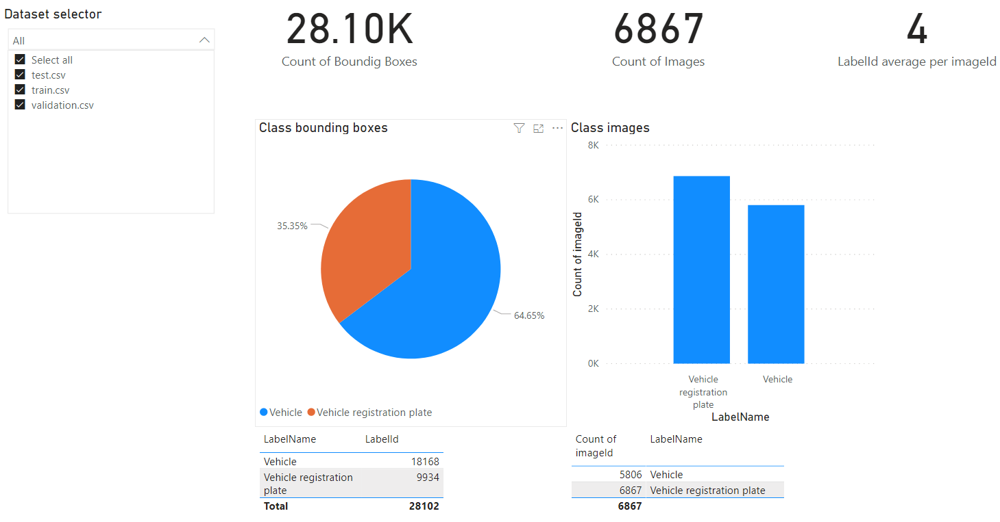
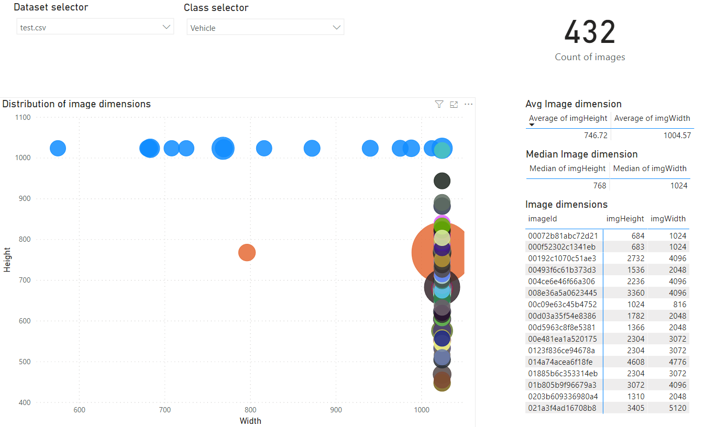
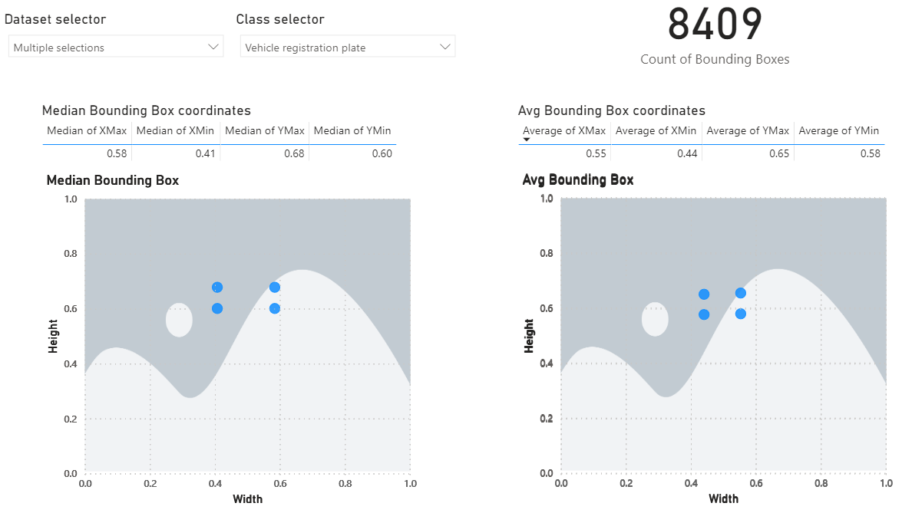

# Data report

This is the folder of the Power BI report that visualizes the dataset used to train/evaluate the detector network. The report can be used to analyze the raw and the splitted dataset as well. Change the data source folder to *source/raw* or to *source/splitted* accordingly.

Distribution of images per label types:

Image dimensions in the test set containing Vehicle bounding boxes:

Average & median Vehicle registration plate bounding box coordinates:

The report was used to split the data evenly, as the original Open Images Dataset train/validation/test subsets had different bounding box coordinate distributions & multiplicities per images.